# 넥슨 - 이벤트 / 보상 관리 플랫폼 구축

## 목차

1. [프로젝트 개요](#프로젝트-개요)
2. [개발 철학 및 접근 방식](#개발-철학-및-접근-방식)
3. [Clean + Layered 아키텍처 적용](#Clean-+-Layered-키텍처-적용)
4. [시스템 구성](#시스템-구성)
5. [구현 고려사항 및 설계 결정](#구현-고려사항-및-설계-결정)
6. [시작하기](#시작하기)
7. [API 문서](#api-문서)
8. [향후 발전 방향](#향후-발전-방향)

---

## 프로젝트 개요

본 시스템은 서비스에서 사용할 수 있는 이벤트 및 보상 관리 플랫폼입니다. 운영자가 정의한 룰에 따라 유저 행동을 추적하고 조건 달성 시 자동으로 또는 운영자 승인을 통해 보상을 지급하는 기능을 제공합니다.

## 개발 철학 및 접근 방식

### 개발 원칙

이 프로젝트를 개발하면서 저는 다음과 같은 개인적인 개발 원칙을 적용했습니다:

1. **다이어그램 주도 설계**: 코드 작성 전에 ERD, 시퀀스 다이어그램, 시스템 아키텍처 다이어그램을 먼저 작성하여 설계 검증을 우선시했습니다.
2. **지속적 리팩토링**: '작동하는' 코드에서 '좋은' 코드로 발전시키기 위해 작은단위로 지속적인 리팩토링을 수행했습니다.
3. **실무 지향 설계**: 단순히 과제 완성을 넘어 실제 프로덕션 환경에서 발생할 수 있는 문제들을 고려했습니다.

### 마이크로서비스 아키텍처 접근 방식

본 프로젝트는 과제 요구사항에 따라 마이크로서비스 아키텍처로 구현했습니다. 이 아키텍처를 활용하면서 제가 생각한 장점과 구현 방향은 다음과 같습니다:

1. **확장성**: 사용자 증가에 따라 Auth 서버와 Event 서버를 독립적으로 확장할 수 있어 리소스 효율성을 높일 수 있습니다.
2. **유연한 개발과 배포**: 각 서비스를 독립적으로 개발하고 배포할 수 있어 이벤트 서버의 규칙 엔진 수정이 인증 시스템에 영향을 주지 않습니다.
3. **장애 격리**: 실제 운영 환경의 중요한 부분인데, 특정 이벤트 처리 중 문제가 발생해도 인증 시스템은 계속 작동할 수 있습니다.
4. **기술 선택의 자유**: 각 도메인에 최적화된 기술 선택이 가능하지만, 이번 구현에서는 일관성을 위해 NestJS로 통일했습니다.
5. **팀 협업 구조**: 실무에서는 각 마이크로서비스별로 담당 팀을 구성하여 독립적인 개발 사이클을 가질 수 있습니다.

## Clean + Layered 아키텍처 적용

시스템의 내부 구조는 클린 아키텍처와 계층형 아키텍처의 장점을 결합한 Clean+Layered 아키텍처를 적용했습니다. 이는 이론적 순수성보다 실무에서의 효율성과 생산성을 극대화하기 위한 선택이었습니다.

### 순수한 클린 아키텍처와 실무에서의 어려움

순수한 클린 아키텍처는 이론적으로 완벽하지만, 실제 프로젝트에서는 다음과 같은 문제점이 있었습니다:

1. **개발 생산성 저하**: 의존성 규칙을 엄격하게 지키기 위해 많은 중간 계층과 어댑터를 작성해야 함
2. **과도한 복잡성**: 간단한 CRUD 작업도 다수의 클래스와 인터페이스를 통과하는 복잡한 경로 발생
3. **실용적 타협의 어려움**: 프레임워크 특성(NestJS의 데코레이터 등)을 활용하기 어려움

### Clean+Layered의 실용적 접근

이런 문제점을 해결하기 위해, 다음 원칙을 따르는 Clean+Layered 아키텍처를 고안했습니다:

| 항목 | 설명 |
|------|------|
| **핵심 도메인 순수성** | 비즈니스 로직은 외부 프레임워크나 DB 의존 없이 순수 TypeScript로 구현 |
| **계층 간 책임 구분** | Presentation -> Application -> Domain <- Infrastructure로 역할과 책임을 명확히 분리 |
| **도메인 주도 설계 요소** | Entity, DomainService 등 적극 도입 |
| **프레임워크 활용과 격리의 균형** | NestJS의 유틸리티(Guard, Decorator 등)는 활용하되 도메인 로직은 격리 |
| **단방향 의존성 유지** | 외부 → 내부 방향의 의존성만 허용하여 구조적 안정성 확보 |
| **기술 변화 대응력** | Mongo → 다른 DB로 교체하거나 이벤트 시스템 변경 시에도 도메인은 그대로 유지 가능 |
| **유지보수 중심** | 변경이 잦은 도메인(이벤트/보상 규칙)을 빠르게 반영할 수 있도록 설계 |

### 계층 구조와 책임 정의

각 마이크로서비스는 다음과 같은 계층으로 구성되어 있습니다:

1. **프레젠테이션 계층 (Presentation Layer)**
   - **위치**: `apps/*/src/presentation/`
   - **책임**: HTTP 요청 처리, 입력 유효성 검사, 권한 검증, 응답 포맷팅
   - **기술**: NestJS 컨트롤러, DTO, 인터셉터, 필터
   - **예시**: `EventController`에서 이벤트 생성 API 엔드포인트 처리

2. **애플리케이션 계층 (Application Layer)**
   - **위치**: `apps/*/src/application/`
   - **책임**: 유스케이스 오케스트레이션, 트랜잭션 관리, 도메인 서비스 조합
   - **기술**: 퍼사드 패턴, CQRS, 이벤트 발행
   - **예시**: `EventFacade`에서 이벤트 생성 프로세스 조정

3. **도메인 계층 (Domain Layer)**
   - **위치**: `apps/*/src/domain/`
   - **책임**: 핵심 비즈니스 로직, 규칙, 엔티티, 값 객체 정의
   - **기술**: 순수 TypeScript 클래스, 인터페이스, 타입
   - **예시**: `EventEntity`에서 이벤트 유효성 검증 로직 구현

4. **인프라스트럭처 계층 (Infrastructure Layer)**
   - **위치**: `apps/*/src/infrastructure/`, `libs/infrastructure/`
   - **책임**: 영속성, 외부 서비스 통합, 기술적 구현
   - **기술**: 데이터베이스 연결, 캐싱, 메시징, 로깅
   - **예시**: `MongoEventRepository`에서 이벤트 데이터 저장 및 조회

---

### 의존성 규칙과 흐름

클린+계층형 아키텍처의 핵심은 의존성 방향 제어입니다:

```
[외부 계층] → [내부 계층]
프레젠테이션 → 애플리케이션 → 도메인 ← 인프라스트럭처
```

주목할 점은 인프라스트럭처 계층이 도메인 계층에 의존하는 방식입니다:

```typescript
// domain/repositories/event-repository.interface.ts
export interface EventRepository {
  findByUserId(userId: string): Promise<Event[]>;
  save(event: Event): Promise<void>;
}

// infrastructure/repositories/mongo-event.repository.ts
@Injectable()
export class MongoEventRepository implements EventRepository {
  constructor(
    @InjectModel(EventModel.name) private eventModel: Model<EventDocument>
  ) {}
  
  async findByUserId(userId: string): Promise<Event[]> {
    const events = await this.eventModel.find({ userId }).exec();
    return events.map(event => this.mapToEntity(event));
  }
  
  async save(event: Event): Promise<void> {
    await this.eventModel.updateOne(
      { id: event.id },
      this.mapToDocument(event),
      { upsert: true }
    );
  }
  
  private mapToEntity(doc: EventDocument): Event {
    // 문서에서 도메인 엔티티로 변환
  }
  
  private mapToDocument(entity: Event): Record<string, any> {
    // 도메인 엔티티에서 문서로 변환
  }
}
```

이를 통해 도메인 계층은 구체적인 데이터베이스 구현에 의존하지 않으며, 필요시 다른 저장소로 쉽게 교체할 수 있습니다.

### Clean+Layered 아키텍처의 실무 이점

이 아키텍처를 적용함으로써 얻은 실질적인 이점은 다음과 같습니다:

1. **유지보수성 향상**: 핵심 비즈니스 로직이 외부 의존성으로부터 보호되어 안정적인 시스템 구축
2. **확장성 확보**: 시스템 일부만 수정하거나 확장하는 것이 용이함
3. **테스트 용이성**: 핵심 비즈니스 로직을 의존성 없이 단위 테스트 가능
4. **개발 생산성 유지**: 과도한 보일러플레이트 코드 없이 클린 아키텍처의 핵심 원칙 준수
5. **기술 부채 최소화**: 명확한 구조로 인해 새로운 개발자도 쉽게 코드베이스 이해 가능

이러한 Clean+Layered 아키텍처는 순수한 이론적 접근보다 실무 환경에서 훨씬 더 효과적으로 작동하며, 팀의 생산성과 코드 품질을 동시에 높일 수 있었습니다.

## 시스템 구성

### 마이크로서비스 구성

본 시스템은 3개의 핵심 마이크로서비스로 구성되어 있습니다:

1. **API Gateway (Port 3000)**
   - 모든 클라이언트 요청의 진입점
   - API 문서화
   - 인증 및 권한 검증
   - 요청 라우팅 및 로드 밸런싱

2. **Auth Service (Port 3001)**
   - 사용자 등록 및 인증
   - JWT 토큰 관리
   - 역할 및 권한 관리

3. **Event Service (Port 3002)**
   - 이벤트 및 보상 관리
   - 이벤트 조건 검증
   - 보상 요청 처리

### 주요 도메인 모델

1. **Event (이벤트)**: 이벤트 정보 및 조건 정의
   - 조건 타입 (로그인, 초대 등)
   - 조건 매개변수 (필요한 로그인 일수, 초대 인원 등)
   - 활성 상태 및 기간

2. **Reward (보상)**: 이벤트 달성 시 제공되는 혜택
   - 보상 타입 (아이템, 포인트 등)
   - 보상 매개변수 (수량, 만료 기간 등)
   - 승인 요구 여부

3. **RewardClaim (보상 청구)**: 유저의 보상 요청 및 처리 상태
   - 처리 상태 (대기, 승인, 거부, 완료)
   - 승인자 정보
   - 처리 시간

## 구현 고려사항 및 설계 결정

#### 자동 보상 프로세스 (유저 회원가입 이벤트 기반)
1. 유저 행동 데이터 수집 (user_events)
2. 규칙 엔진에서 조건 충족 여부 평가
3. 유저의 보상 요청 → Gateway → Event Server
4. 자격 조건 충족 시 자동 승인 및 보상 지급 처리
5. 이력 기록 및 분산 락 해제

#### 수동 승인 프로세스 (유저 로그인 이벤트 기반)
1. 유저 행동 데이터 수집 (user_events)
1. 유저의 보상 요청 → Gateway → Event Server
2. 1차 자격 검증 (중복 요청 방지)
3. 운영자 승인 대기 상태로 전환
4. 운영자 검토 및 승인/거부 결정
5. 보상 지급 처리 및 상태 업데이트

#### Rule 기반 보상 처리 설계

- 모든 이벤트 및 보상 흐름은 `Rule` 객체 기반으로 처리됩니다.
- 각 Rule은 다음 요소로 구성됩니다:
  - `trigger`: 어떤 이벤트에 반응할지 정의
  - `condition`: 유저의 행동 조건 (예: 로그인 횟수, 초대 인원)
  - `action`: 지급할 보상 정보
  - `approvalRequired`: 자동 지급 또는 운영자 승인 여부
- Rule은 MongoDB에 저장되며 핫 리로딩 혹은 캐시 적용을 고려한 구조입니다.
- 조건 평가 방식은 전략 패턴 기반으로, 새로운 이벤트 유형에 쉽게 대응할 수 있습니다.

#### 도메인 간 연동 & 퍼사드 계층

각 도메인(app)은 독립성을 유지하지만, 복합 유즈케이스는 `Facade` 계층에서 orchestration합니다.

예시: `EventFacade`가 보상 흐름 전체를 조율합니다.

```ts
class EventFacade {
  async handleEventReport(eventType, userId) {
    const rules = await this.ruleRepo.findByTrigger(eventType);
    for (const rule of rules) {
      const ok = await this.evaluator.evaluate(rule, userId);
      if (ok) {
        rule.approvalRequired
          ? await this.rewardService.queueForApproval(rule, userId)
          : await this.rewardService.grantImmediateReward(rule, userId);
      }
    }
  }
}
```
이 방식은:

- 유저 이벤트 흐름을 하나의 진입점에서 처리 가능하게 만들고,
- 각 도메인의 책임을 분리하면서도 유스케이스 구현은 간결하게 유지합니다.

#### 테스트 전략 요약

- **단위 테스트 (Unit Test)**:  
  RuleEvaluator, RewardExecutor 등 핵심 로직은 외부 의존성 없이 테스트 가능하도록 구성

- **통합 테스트 (Integration Test)**:  
  `curl + docker-compose` 환경에서 실제 흐름을 검증하는 `AUTOMATED_INTEGRATION_TEST.sh` 스크립트 제공

- **테스트 설계 고려사항**:
  - 의존성 주입을 통해 mock 주입 가능
  - Guard 및 인증 흐름은 통합 테스트에서 검증
  - Reward 중복 방지 로직, 운영자 승인 분기 등 핵심 흐름에 집중

## 시작하기

### 사전 요구사항

- Docker 및 Docker Compose 설치
- Node.js 18 이상

### 설치 및 실행

#### Docker Compose 사용

```
# 프로젝트 클론
git clone https://github.com/your-username/Nexon-Event-Reward-System.git
cd Nexon-Event-Reward-System

# Docker 컨테이너 실행
docker-compose up -d

# 컨테이너 확인
docker ps

# 서비스 확인:
- Gateway API: http://localhost:3000
- MongoDB: localhost:27017
- MongoDB Express(관리자 UI): http://localhost:8081
- Redis: localhost:6379

### MongoDB 접속 방법
- **MongoDB Express**: http://localhost:8081 접속하여 웹 기반 관리 도구 사용
- **MongoDB Compass**: MongoDB 공식 GUI 도구를 사용하여 `mongodb://localhost:27017` 주소로 연결
- **MongoDB Shell**: 커맨드라인에서 `mongosh mongodb://localhost:27017/nexon-event-system` 명령어로 연결

```

#### 자동화된 통합 테스트 실행하기

`AUTOMATED_INTEGRATION_TEST.sh` 스크립트를 사용하여 전체 시스템의 통합 테스트를 자동으로 실행할 수 있습니다. 이 스크립트는 다음과 같은 테스트를 수행합니다:

1. 사용자 계정 관리 (회원가입, 로그인)
2. 역할 기반 권한 검증 (관리자, 일반 사용자, 감사자)
3. 이벤트, 보상 생성 및 관리 (회원가입, 로그인 기반 이벤트 및 보상)
4. 보상 청구 및 승인 프로세스 (수동, 자동)
5. 중복 요청 방지 검증
6. 감사자 역할 검증

|  |  |
|:---:|:---:|
| 통합 테스트 실행 결과 1 | 통합 테스트 실행 결과 2 |

## API 문서

각 서비스에 대한 Swagger API 문서를 제공합니다:

- Gateway API Docs: http://localhost:3000/api/docs
- local curl Test guide: [MANUAL_API_TEST_GUIDE](./docs/MANUAL_API_TEST_GUIDE.md)


## 향후 발전 방향
1. **Redis 고가용성 아키텍처 구현**
   - Master-Slave 복제 구조 도입으로 읽기 성능 향상
   - Redis Sentinel으로 자동 장애 복구 체계 구축

2. **메시지 큐 시스템 고도화**
   - Kafka 기반 이벤트 스트리밍 플랫폼 구축
   - 분산 트랜잭션 관리 및 이벤트 소싱 패턴 적용
   - 실시간 이벤트 처리 파이프라인 구축

3. **룰 기반 엔진 고도화**
   - 동적 규칙 정의 DSL(Domain Specific Language) 개발
   - 규칙 시뮬레이션 및 테스트 도구 개발
   - 이상 탐지 시스템 연동

4. **실시간 알림 시스템 구현**
   - Socket.io 기반 실시간 이벤트 알림
   - 푸시 알림 및 이메일 연동 시스템 구축
   - 알림 선호도 설정 및 개인화 기능

이러한 향후 계획들은 실제 프로덕션 환경에서 발생할 수 있는 기술적 도전과 대규모 사용자 기반을 지원하기 위한 확장성 요구사항을 고려하여 설계되었습니다.

초기에는 아래와 같은 마이크로서비스 아키텍처를 설계했으나, 프로젝트 자원 제약으로 인해 일부 기능은 확장성을 고려한 인터페이스와 기본 구현체만 개발하였습니다. 향후 시스템 확장 시 이러한 기반을 활용하여 완전한 기능 구현이 가능하도록 설계하였습니다.

```mermaid
flowchart TD
    %% 클라이언트 노드
    Client(["👨‍💼 클라이언트 앱"]):::clientNode
    BackOffice(["👨‍💻 백오피스 UI"]):::clientNode
    
    %% 클라이언트 연결
    Client -- "HTTP 요청" --> Gateway
    BackOffice -- "HTTP 요청" --> Gateway
    
    %% API 계층
    subgraph ApiLayer["🌐 API Layer"]
        Gateway[("API Gateway<br/>NestJS")]:::gatewayNode
    end
    
    %% 서비스 계층
    subgraph ServiceLayer["🔐 Service Layer"]
        Auth["🔑 Auth Service<br/>(사용자/인증)"]:::serviceNode
        Event["🎮 Event Service<br/>(이벤트/보상)"]:::serviceNode
    end
    
    %% 데이터 계층
    subgraph DataLayer["💾 Infrastructure"]
        MongoDB[(MongoDB<br/>데이터 저장)]:::dbNode
        Redis[(Redis<br/>캐시/락)]:::cacheNode
        EventBus["📨 Event Bus"]:::eventNode
    end
    
    %% 서비스 내부 모듈
    subgraph EventModules["🧩 Event Service Modules"]
        RuleEngine["⚙️ Rule Engine"]:::moduleNode
        RewardModule["🏆 Reward Module"]:::moduleNode
        ValidationModule["✅ Validation Module"]:::moduleNode
    end
    
    %% 주요 연결
    Gateway -- "인증/권한" --> Auth
    Gateway -- "이벤트/보상" --> Event
    Auth -- "유저 데이터" --> MongoDB
    Event -- "이벤트 데이터" --> MongoDB
    Event -- "캐싱/분산락" --> Redis
    Auth -- "세션 데이터" --> Redis
    
    %% 이벤트 기반 통신
    Auth <---> |"이벤트 발행/구독"| EventBus
    Event <---> |"이벤트 발행/구독"| EventBus
    
    %% 모듈 연결
    Event --- RuleEngine
    Event --- RewardModule
    Event --- ValidationModule
    
    %% 스타일 정의
    classDef clientNode fill:#ff9eb1,stroke:#333,stroke-width:2px,color:#333,font-weight:bold
    classDef gatewayNode fill:#9ea1ff,stroke:#333,stroke-width:2px,color:#333,font-weight:bold
    classDef serviceNode fill:#a1ffb0,stroke:#333,stroke-width:2px,color:#333,font-weight:bold
    classDef dbNode fill:#ffcc9e,stroke:#333,stroke-width:3px,color:#333,font-weight:bold
    classDef cacheNode fill:#9eceff,stroke:#333,stroke-width:3px,color:#333,font-weight:bold
    classDef moduleNode fill:#f9f39e,stroke:#333,stroke-width:2px,color:#333,font-weight:bold
    classDef eventNode fill:#dda1ff,stroke:#333,stroke-width:2px,color:#333,font-weight:bold
    
    %% 서브그래프 스타일
    style ApiLayer fill:#f0f0f0,stroke:#333,stroke-width:2px
    style ServiceLayer fill:#f0f0f0,stroke:#333,stroke-width:2px
    style DataLayer fill:#f0f0f0,stroke:#333,stroke-width:2px
    style EventModules fill:#f0f0f0,stroke:#333,stroke-width:2px
```



